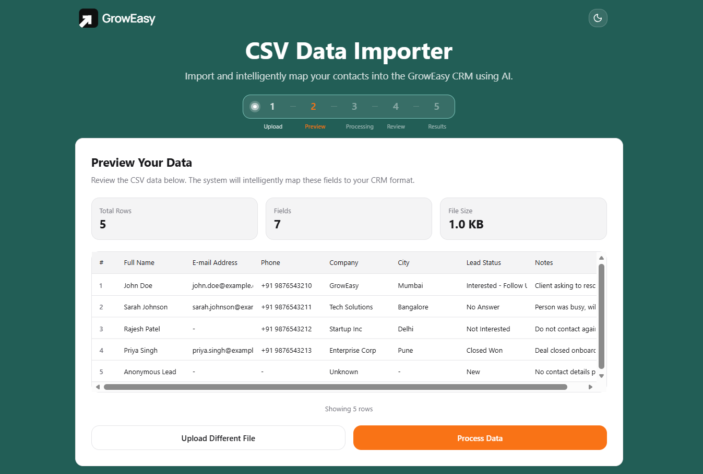
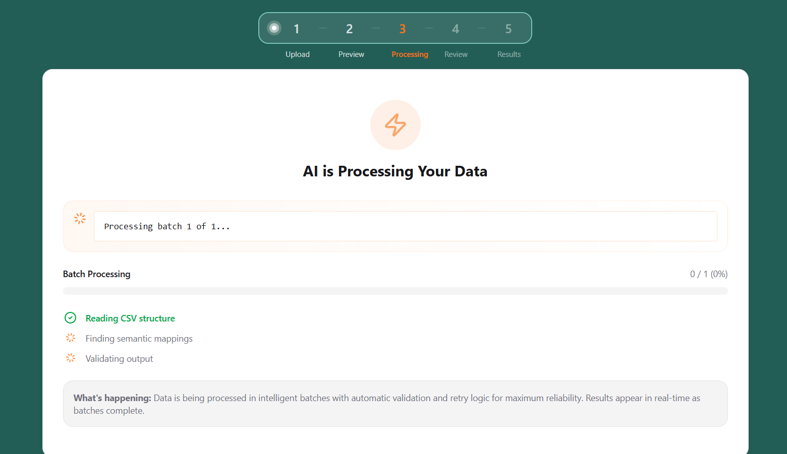
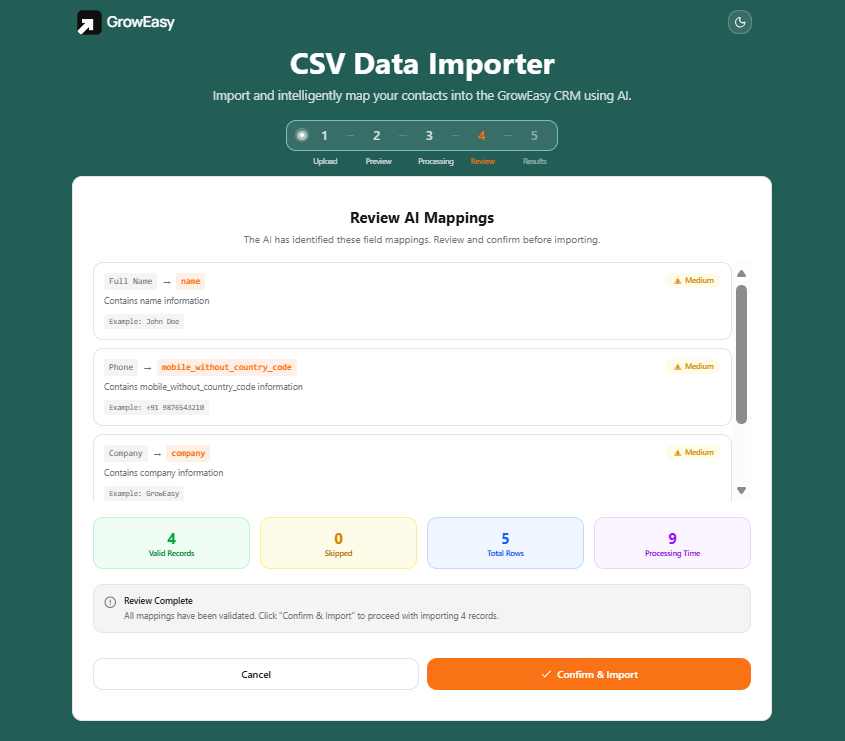
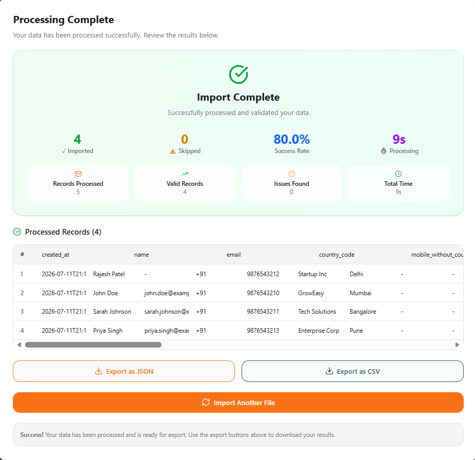
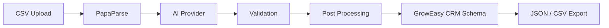

<h1 align="center">
  
  GrowEasy AI CSV Importer
</h1>

<p align="center">
  AI-powered CSV Import & Intelligent CRM Field Mapping
</p>

<p align="center">
  
  
  
  
  
</p>

An enterprise-grade CSV ingestion pipeline for the **GrowEasy CRM** platform. Uses Large Language Models (LLMs) to automatically interpret, clean, validate, and map arbitrarily structured CSV files into the standardised GrowEasy CRM lead schema.

---

## 📸 Screenshots


*Upload Step — Drag and drop or select a CSV file for processing.*



*Preview Step — Review the parsed CSV data before processing.*



*Processing Step — Live streaming results with real-time stats.*



*Mapping Review — AI-inferred field mappings with confidence scores before finalizing.*



*Results Step — Export processed data as JSON or CSV.*

---

## ✨ Features

| Feature | Description |
|:---------|:------------|
| 🤖 **AI Field Mapping** | Automatically maps arbitrary CSV columns into the **15-field GrowEasy CRM schema** using OpenRouter, Gemini, OpenAI, or an offline Mock provider. |
| 🧭 **5-Step Import Wizard** | Guided workflow: **Upload → Preview → Processing → Review Mappings → Results** for a seamless import experience. |
| ⚡ **Streaming Processing** | Uses **Server-Sent Events (SSE)** to stream batch results in real time instead of waiting for the entire import to finish. |
| 📊 **Virtualized Tables** | Efficiently renders **100,000+ rows** using `@tanstack/react-virtual` without performance degradation. |
| 🚀 **Concurrent Batch Processing** | Processes **30 rows per batch**, supports **10 concurrent AI requests**, and retries failed batches with exponential backoff (3 attempts). |
| 🔄 **Automatic AI Fallback** | Automatically switches to the offline **Mock Provider** if the selected AI provider becomes unavailable. |
| 📞 **Multi-Value Extraction** | Splits multiple emails and phone numbers intelligently, storing extras inside `crm_note`. |
| 📋 **15 CRM Fields** | Supports all required CRM fields including `created_at`, `name`, `email`, `country_code`, `mobile_without_country_code`, `company`, `city`, `state`, `country`, `lead_owner`, `crm_status`, `crm_note`, `data_source`, `possession_time`, `description`. |
| 🌓 **Dark Mode** | Fully responsive light and dark themes with a modern UI and smooth transitions. |
| 📤 **Export Results** | Export processed records in both **JSON** and **CSV** formats. |
| 📂 **Drag & Drop Upload** | Modern upload experience with drag & drop, click-to-browse, CSV validation, and a **5 MB** size limit. |
| 🎯 **Mapping Review** | Displays AI-generated field mappings with confidence scores before importing into the CRM. |
| 🛡 **Prompt Injection Protection** | Treats every CSV value as raw data to prevent prompt injection and malicious input. |
| 🧪 **Edge Case Handling** | Robust handling of Unicode, special characters, empty rows, malformed records, mixed delimiters, and incomplete data. |

---

## ⭐ Project Highlights

- ✅ AI-powered CSV field mapping
- ✅ 100,000+ row support
- ✅ 78 automated tests
- ✅ 4 AI providers
- ✅ Server-Sent Events (SSE)
- ✅ Retry mechanism
- ✅ Automatic fallback provider
- ✅ Dark mode
- ✅ Export JSON & CSV
- ✅ Prompt injection protection
  
---

## 🏗 Architecture



---

## 🚀 Tech Stack

| Technology | Purpose |
|------------|---------|
| ⚛ React 19 | User Interface |
| ▲ Next.js 16 | Framework |
| 🔷 TypeScript | Type Safety |
| 🎨 Tailwind CSS v4 | Styling |
| 🤖 OpenRouter / Gemini / OpenAI | AI Processing |
| 📄 PapaParse | CSV Parsing |
| ▲ Next.js API Routes | Backend API |
| 🧪 Jest + Supertest | Testing |
| ⚡ TanStack Virtual | Large Dataset Rendering |

---

## 🎨 Design System

### Brand Colors

| Primary | Accent | Background | Surface | Dark |
|:-------:|:------:|:----------:|:--------:|:-----:|
| 🟧 `#F97316` | 🌿 `#225E56` | ⬜ `#FAFAFA` | ⚪ `#FFFFFF` | ⚫ `#0F0F12` |

### UI Principles

| Element | Specification |
|:--------|:--------------|
| 📝 **Font** | Manrope (400–800) |
| 🔘 **Radius** | 16px Cards • 12px Buttons & Inputs |
| 🌫 **Shadows** | Soft `shadow-card` elevation |
| ✨ **Animations** | Smooth hover, focus & page transitions |
| 📱 **Responsive** | Mobile-first layout with adaptive spacing |
| 🎯 **Style** | Clean SaaS interface inspired by GrowEasy branding |

---

## 📂 Directory Structure

```text
📦 groweasy-ai-csv-importer
│
├── 📁 app
│   ├── 📄 page.tsx                     # Landing page with GrowEasy branding
│   ├── 📄 layout.tsx                   # Root layout, metadata & Manrope font
│   └── 📄 globals.css                  # Global styles & design system
│
├── 📁 components
│   ├── 📁 csv-importer
│   │   ├── 📄 csv-importer.tsx         # Main step orchestrator
│   │   └── 📁 steps
│   │       ├── 📄 upload-step.tsx          # CSV upload & validation
│   │       ├── 📄 preview-step.tsx         # Virtualized CSV preview
│   │       ├── 📄 processing-step.tsx      # Live SSE processing
│   │       ├── 📄 mapping-review-step.tsx  # AI mapping review
│   │       └── 📄 results-step.tsx         # Results & export
│   │
│   ├── 📄 blur-text.tsx               # Animated heading
│   ├── 📄 dark-mode-toggle.tsx        # Theme switch
│   ├── 📄 groweasy-logo.tsx           # Brand logo
│
├── 📁 services
│   ├── 📄 ai-provider-interface.js    # Base AI provider
│   ├── 📄 ai-provider-factory.js      # Factory pattern
│   ├── 📄 llm-service.js              # AI orchestration
│   └── 📁 providers
│       ├── 📄 openrouter-provider.js
│       ├── 📄 gemini-provider.js
│       ├── 📄 openai-provider.js
│       └── 📄 mock-provider.js
│
├── 📁 tests
│   ├── 📄 api.test.js
│   ├── 📄 validation.test.js
│   ├── 📄 mock-provider.test.js
│   ├── 📄 post-process-row.test.js
│   ├── 📄 llm-service.test.js
│   ├── 📄 factory.test.js
│   ├── 📄 edge-cases.test.js
│   └── 📄 provider-factory.manual.js
│
├── 📁 public
│   ├── 🖼️ icon.svg                    # Favicon
│   ├── 📄 Sample-CRM-Records.csv      # Sample dataset
│   ├── 📄 Test-With-Skipped.csv       # Test CSV with skipped record (no email/phone)
│   └── 🖼️ images/                     # README screenshots
│
├── 📁 archive                         # Archived documentation
│
├── 📄 jest.config.js                  # Jest configuration
├── 📄 package.json                    # Project metadata & scripts
└── 📄 README.md                       # Documentation
```
---

## Setup

### Prerequisites
- Node.js 18+, pnpm

### Installation

```bash
pnpm install
```

### Environment (`.env`)

```env
# Provider: openrouter (default), gemini, openai, or mock
AI_PROVIDER=openrouter

# API keys (not needed for mock)
OPENROUTER_API_KEY=sk-or-...
GEMINI_API_KEY=...
OPENAI_API_KEY=...

# Models (optional)
OPENROUTER_MODEL=openai/gpt-4o-mini
GEMINI_MODEL=gemini-1.5-flash
```

### Run

```bash
pnpm run dev         # single command — frontend + API routes (port 3000)
```

Open: `http://localhost:3000`

### Using Mock Provider (No API Key)

Set `AI_PROVIDER=mock` in `.env`. The mock provider maps CSV columns using intelligent field name matching (case-insensitive, partial matches). It also serves as automatic fallback when the real AI provider fails.

---

## Tests

78 unit and integration tests (Jest + Supertest):

```bash
pnpm test
```

## 🧪 Testing Strategy

> **78 automated tests** ensure reliability across the complete AI-powered CSV import workflow.

| Category | What is Verified |
|:---------|:-----------------|
| 🚀 **API** | Endpoints, validation, batch processing, SSE streaming, and error handling |
| 🤖 **AI Providers** | Field extraction, provider fallback, mock integration, and orchestration |
| 📋 **Validation** | CRM schema rules, status values, data sources, and date parsing |
| 📞 **Data Processing** | Email & phone splitting, note preservation, and post-processing |
| ⚠️ **Edge Cases** | Unicode, malformed CSVs, whitespace, boundary dates, and invalid records |
| 🏗 **Factory Pattern** | Provider creation, dependency injection, and configuration validation |

### Test Suites

- 🌐 `api.test.js`
- ✅ `validation.test.js`
- 🤖 `mock-provider.test.js`
- 📧 `post-process-row.test.js`
- 🔄 `llm-service.test.js`
- 🏭 `factory.test.js`
- 🧩 `edge-cases.test.js`

---

## 🔌 API Endpoints

Next.js API routes handle synchronous processing, real-time streaming, and health monitoring — no separate backend server required.

| Method | Endpoint | Description |
|:------:|:---------|:------------|
| `POST` | `/api/process` | Processes CSV records synchronously in batches and returns the complete result after all batches finish. |
| `POST` | `/api/process-stream` | Streams processing progress in real time using **Server-Sent Events (SSE)**. |
| `GET` | `/api/health` | Returns the current server health status. |

### 📡 Streaming Events (`/api/process-stream`)

```text
event: start
→ { total }

event: batch
→ { batchIndex, totalBatches, processed, skipped, errors }

event: complete
→ { stats, mappings }

event: error
→ { message }
```

> **Streaming Benefits:** Real-time progress • Incremental results • Lower perceived latency • Better UX for large CSV imports

---

## 🤖 AI Provider Architecture

The application follows the **Factory + Strategy Design Pattern**, enabling multiple AI providers to be swapped seamlessly without changing the business logic.

### Provider Hierarchy

```text
                    AIProviderFactory
                           │
          create(providerName)
                           │
                           ▼
                  AIProvider (Abstract)
                           │
      ┌────────────┬────────────┬────────────┬
      ▼            ▼            ▼            ▼
 OpenRouter     Gemini       OpenAI       Mock
   Provider     Provider     Provider    Provider
```

### Supported Providers

| Provider | Model | Purpose |
|:---------|:------|:--------|
| 🤖 OpenRouter | `openai/gpt-4o-mini` | Default AI provider |
| ✨ Gemini | `gemini-1.5-flash` | Google AI integration |
| 🧠 OpenAI | `gpt-4o` | Native OpenAI support |
| 🧪 Mock | Offline | Development, testing & automatic fallback |

### Provider Responsibilities

Every provider implements the same interface:

| Method | Responsibility |
|:-------|:---------------|
| `extractCRMData(records)` | Extract structured CRM fields from CSV records |
| `postProcessRow(row)` | Normalize emails & phone numbers, merge extras into `crm_note` |
| `validateExtractedRow(row)` | Validate CRM status, data source, dates, and mandatory fields |
| `getSystemPrompt()` | Generate the shared AI prompt for consistent extraction |

> **Benefits:** Extensible • Provider Agnostic • Automatic Fallback • Easy Testing • Clean Separation of Concerns

---

## 🧠 AI Extraction Rules

The LLM follows a strict set of extraction rules to ensure every processed record conforms to the GrowEasy CRM schema while minimizing hallucinations and invalid data.

| Rule | Description |
|:-----|:------------|
| 🎯 **CRM Status** | Accepts only `GOOD_LEAD_FOLLOW_UP`, `DID_NOT_CONNECT`, `BAD_LEAD`, or `SALE_DONE`. |
| 🏢 **Data Source** | Maps only supported project sources (`leads_on_demand`, `meridian_tower`, `eden_park`, `varah_swamy`, `sarjapur_plots`). Leaves blank if no match exists. |
| 📅 **Date Parsing** | Ensures `created_at` is compatible with JavaScript's `new Date()` parser. |
| 📝 **CRM Notes** | Stores follow-up remarks, unmapped values, additional emails, phone numbers, and miscellaneous information. |
| 📞 **Multi-Value Handling** | Uses the first email/phone as the primary value and appends remaining values to `crm_note`. |
| 📄 **CSV Compatibility** | Maintains one CRM record per CSV row and preserves multiline content using escaped `\n`. |
| 🚫 **Invalid Record Filtering** | Skips records that contain neither an email address nor a mobile number. |
| 🛡 **Hallucination Prevention** | Never fabricates missing information; unmatched fields remain empty. |

> **Objective:** Produce clean, deterministic, and CRM-ready records while preserving all useful information from the original CSV.

---

## ✅ Validation Rules

All extracted records are validated before being included in the final CRM dataset, ensuring data quality and compliance with the GrowEasy CRM schema.

| Validation Rule | Enforcement |
|:----------------|:------------|
| 📧 **Contact Requirement** | Records must contain at least one **email** or **mobile number**; otherwise they are skipped. |
| 🎯 **CRM Status** | Accepts only the four predefined CRM status values (case-sensitive). |
| 🏢 **Data Source** | Must match one of the supported GrowEasy project sources; otherwise left blank. |
| 📅 **Date Format** | `created_at` must be compatible with JavaScript's `new Date()` parser. |
| 📞 **Multi-Value Handling** | Primary email/phone is retained; additional values are moved to `crm_note`. |
| ✂️ **Whitespace Normalization** | Email addresses and phone numbers are trimmed before processing. |
| 📂 **File Validation** | Only `.csv` files up to **5 MB** are accepted. |

> **Validation Goal:** Ensure every exported record is clean, consistent, and ready for direct CRM import.

---

## 🎁 Bonus Features

The following enhancements were implemented beyond the core CSV import functionality to improve usability, scalability, and developer experience.

| Feature | Status |
|:--------|:------:|
| 📂 Drag & Drop CSV Upload | ✅ |
| 📈 Real-time Processing Progress | ✅ |
| ⚡ Server-Sent Events (SSE) Streaming | ✅ |
| 🔄 Automatic Retry (3 Attempts + Exponential Backoff) | ✅ |
| 📊 Virtualized Tables (100K+ Rows) | ✅ |
| 🌙 Dark Mode Support | ✅ |
| 🧪 78 Automated Unit & Integration Tests | ✅ |

> **Result:** A production-inspired CSV importer with enterprise-grade UX, scalability, and reliability.

---

## 🛠 Troubleshooting

Common issues and their recommended solutions.

| Issue | Solution |
|:------|:---------|
| ⚠️ **All records skipped** | Set `AI_PROVIDER=mock` to verify the pipeline without requiring an API key. |
| 🔑 **Invalid API Key** | Ensure the correct API key is configured in `.env` for the selected AI provider. |
| 📂 **CSV Upload Failed** | Verify the file is a valid `.csv`, contains a header row, and is smaller than **5 MB**. |
| 🧠 **AI Provider Unavailable** | The application automatically falls back to the Mock Provider if configured. Otherwise, check the provider's availability and API key. |

> **Need more help?** Check the server logs or verify your environment configuration before reporting an issue.

---

<div align="center">

### 🚀 GrowEasy AI CSV Importer

Built with **Next.js**, **React**, **TypeScript**, **Tailwind CSS**, and **OpenRouter AI**

Designed with ❤️ for the **GrowEasy Engineering Assignment**


<div align="center">

### 👨‍💻 Developed by Himanshu Kumar

[](https://www.linkedin.com/in/himanshu4812/)
[](https://github.com/himanshu4812)
[](mailto:himanshu91090@gmail.com)

</div>

</div>
